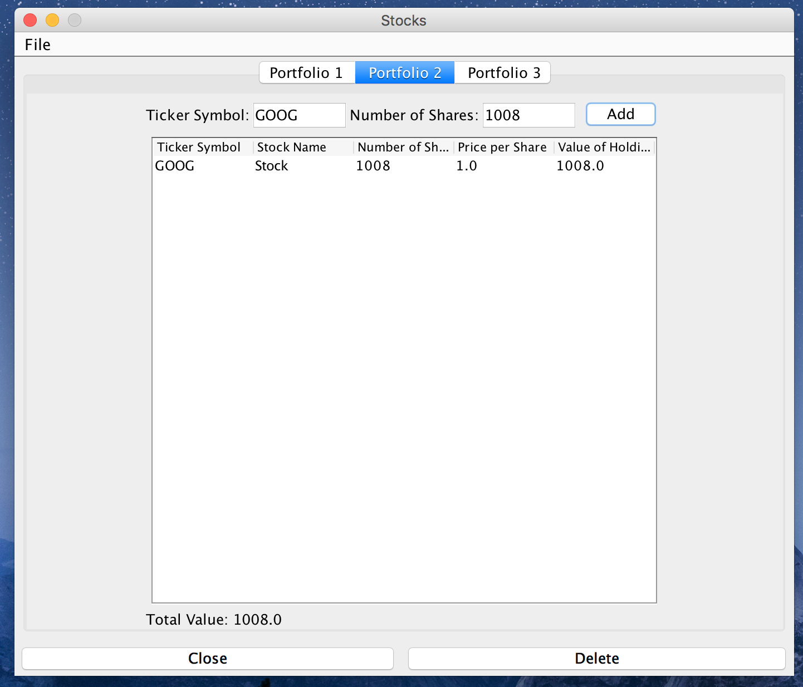

# CS308 FolioTracker

Portfolio Manager is an application that allows you to keep track of Stock prices using portfolios. Price are fetched in Stocks can easily be bought an easy-to-use interface. You can save and load Portfolios from your disk.
Second Assignment for CS308

## Features

* Manage multiple portfolios
* Create and delete portfolios
* See the positions (stock name, number of shares held, price per share, and value of the holding) in a portfolio
* Add and remove stocks to a portfolio
* Increase and decrease the number of shares of a stock
* Refresh stock prices

**Bonus**
* Save and load portfolios
* Rename stocks
* Input validation with meaningful error messages
* Confirmation on critical actions (buy/sell stock and delete)
* Auto refresh prices in stock edit/buy/sell view
* Sorting positions by value, ticker symbol, etc.

## Screenshots

## Group Members

Daniel Kashani CS2015 @fqb16193

Glebs Prohorovs CES2015 @jjb15133

Jed Burrows CS2015 @mjb15164

Martin Kollie @vib15168 

Nicolas Andreou CS2015 @dkb15141